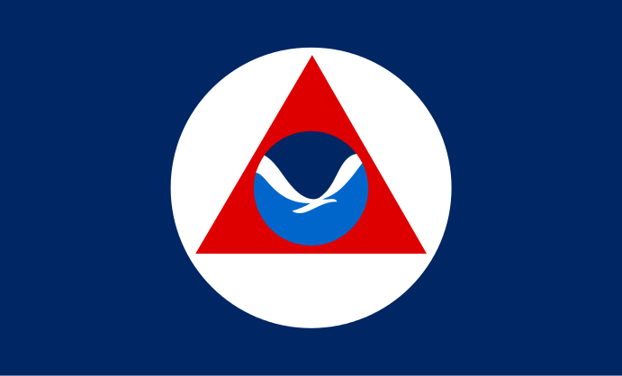
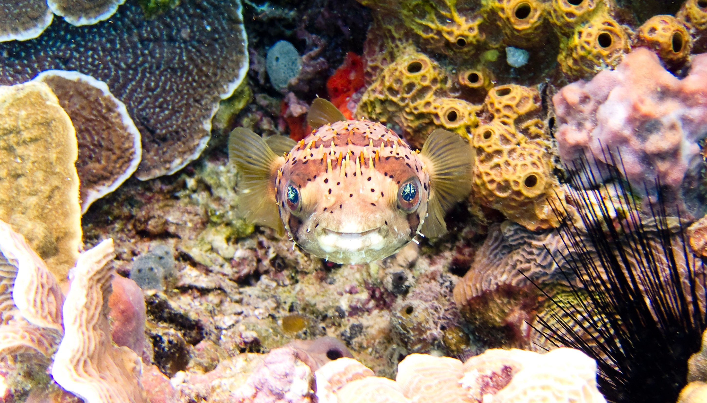

# DSND-Term2-Write-A-Data-Science-Blog-Post
Udacity Data Science Nanodegree Term 2 Project: Write A Data Science Blog Post

## Installation

- jupyter notebook
- pandas
- numpy
- plotly
- chart studio

## Motivation

While many people has considered the space as the "final frontier", I considered the ocean as the "forgotten frontier" that we have yet 
to explore here on earth. I mean we have more people who have been to the moon than to the Mariana Trench - the deepest part of the 
oceans. There is so much we don't know about the ocean. Although the surface area of the Pacific Ocean is wider than the moon, according 
to the NOAA, more than 80% of the world's vast underwater oceans are still unmapped, unobserved, and unexplored.

Knowing all of that, I think it only make sense for use to get to know more about our own ocean. Why is it so important? I thinkg it's
better to let the National Oceanic and Atmospheric Administration (NOAA) explain to you in [this page]; but for me personally it's about
the technological aspect. There are so many things we've invented thanks to the scientists and engineers who helped sent people to the 
moon. For example, the portable computer, wireless headphones, LEDs, and much more. If we could develop such wonderful stuff from space 
exploration, imagine what we could discovered from exploring the ocean.

In this project, we are going to use the NOAA deep-sea coral dataset to....wait for it...build a coastal research resort. The long-term
goal of the research resort is to provide a suitable location for Mariana Trench realted missions; but for the short-term goal, we want 
to provide suitable location and facilities for deep-sea coral research. Why Mariana Trench? And whar does it have to do with corals? 
Well I think it would be better for you you to read my medium blog about this project. It will come out soon, so make sure you stay 
tune.

Blok link: Coming soon!

[this page]: https://oceanexplorer.noaa.gov/backmatter/whatisexploration.html

## File Description

To get the dataset, please refer to https://www.kaggle.com/noaa/deep-sea-corals.

This repository contains a notebook called **Deep Sea Corals.ipynb**, which contains all the main content of the project and analysis.

In the **images** folder, which contains some images for the README and a folder name **visualizations** which containes all the 
visualizations generated from plotly.

## How to interact with the project

I assumed you've already cloned this repository in to your local machine, and that you are using Ubuntu/MacOS with Python installed.

First thing frist, you need to get the dataset from kaggle from [this link]. Make sure you save the dataset in your working directory.

Then, you need to create the virtual environment, activate the environment, and  install all the required libraries.

Finaly, while in your working directory, you can just open the jupyter notebook homepage with the `jupyter notebook` command in the 
terminal.

Also, you can create an account on https://plot.ly/ if you wish to create the visualization on on plotly's official website. This step
is optional, however, because you can just create them on the notebook.

Some Notes:

- Make sure that your working directory is the cloned version of this repository folder.

- If you're using Windows, ther might have to be a couple stuff you need to setup to use Python. For Windows 10 users, using the linux 
sub-system is recommended.

- If you wish to create the visualizations on plotly's official website using the notebook, [here] is the documentation on how to get 
started.

- The plot generated by plotly will make the file size of the notebook very large, and it will take a while for the visualization to 
appear since the dataset contains more than 500k datapoints.

[this link]: https://www.kaggle.com/noaa/deep-sea-corals
[here]: https://plot.ly/python/getting-started-with-chart-studio/

## Acknowledgment

I have to thank the NOAA for all of the provided online content on the their website. I've spent so much time on the it, learning about 
not just corals, but about the ocean in general, and could have not be able to complete the project without those contents.

Author: Gilang Ramadhan Ilhami
